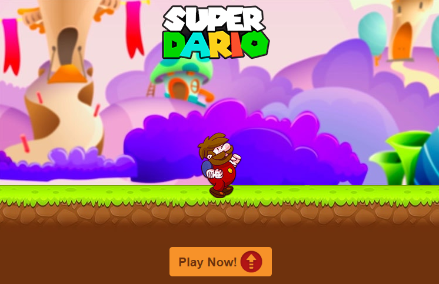

<h1>Super Dario</h1>
<h2>Simple sample game for interactive campaign</h2>

<h3>Check it out!</h3>
<a href="https://andreaweb.github.io/super-dario/">
	https://andreaweb.github.io/super-dario/
</a>

<h3>To install and run the application</h3>

<ul>
	<li>Download it and run <code>npm install</code></li>
	<li>Run <code>gulp watch</code> or <code>npm start</code> to see it on your browser</li>
	<li><code>Gulp</code> is currently minifying css and js automatically and reloading the project on each change</li>
</ul>

<h3>What the app is</h3>

<ul>
	<li>Super Dario runs/walks forever, automatically</li>
	<li>After you click "Play Now" an enemy will appear at the screen</li>
	<li>You must jump to avoid the enemy or Super Dario will get hurt</li>
	<li>If Super Dario is hurt, he becomes small. If he's hurt again, he dies</li>
	<li>To jump, press any key or tap your screen if you're on your phone</li>
</ul>

<h3>How the app works</h3>

<ul>
	<li>Super Dario, the ground and the enemy move constantly through CSS animations</li>
	<li>When the game starts, the position of the enemy (<code>offsetLeft</code>) is constantly compared with Super Dario's position</li>
	<li>If Super Dario and the enemy share the same offsetLeft, but Super Dario is jumping (class <code>.up</code>), Super Dario isn't hurt</li>
	<li>If Super Dario is hurt, JS checks if he has the <code>.small</code> class. If yes, he fades (dies) and the game 'freezes' (animations stop).</li>
	<li>If no, he becomes small by the add of the <code>.small</code> class.</li>
</ul>
